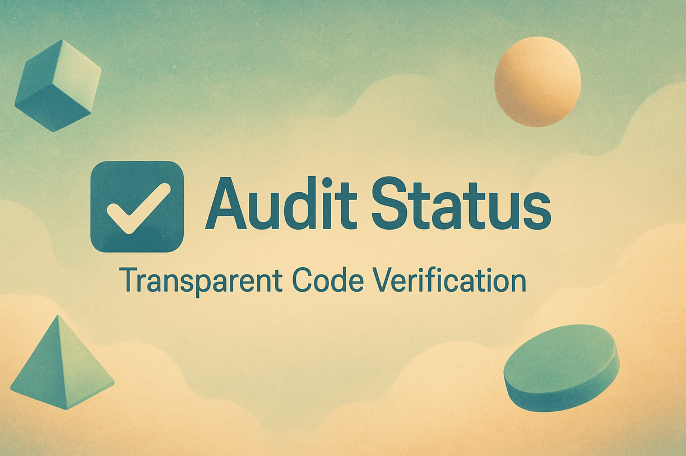

# Audit Status

[](https://github.com/auditstatus/auditstatus.com/actions/workflows/ci.yml)
[](https://coveralls.io/github/auditstatus/auditstatus.com)
[](https://www.npmjs.com/package/auditstatus)



> **Automated third-party auditing system for code integrity verification and transparency**

<a href="https://forwardemail.net">
  
</a>

Audit Status is a project by [Forward Email](https://forwardemail.net) – the 100% open-source, privacy-focused email service.

We created Audit Status to provide transparent, third-party verification of our own server-side code integrity. We believe in open, verifiable systems, and Audit Status is our contribution to a more trustworthy internet.

**🌐 Website**: <https://auditstatus.com>


## Table of Contents

* [Features](#features)
  * [🔍 **Comprehensive Server Auditing**](#-comprehensive-server-auditing)
  * [📊 **Detailed Reporting**](#-detailed-reporting)
  * [⚙️ **Flexible Configuration**](#️-flexible-configuration)
  * [🔒 **Security & Transparency**](#-security--transparency)
* [How It Works](#how-it-works)
  * [1. **Code Verification Layer**](#1-code-verification-layer)
  * [2. **Attestium-Powered Verification**](#2-attestium-powered-verification)
  * [3. **Multi-Environment Support**](#3-multi-environment-support)
* [Attestium Integration](#attestium-integration)
  * [Core Attestium Features Used](#core-attestium-features-used)
  * [Integration Example](#integration-example)
* [TPM 2.0 & Fallback Mechanism](#tpm-20--fallback-mechanism)
  * [🔐 **TPM 2.0 Mode (Production)**](#-tpm-20-mode-production)
  * [🔄 **Software Fallback Mode**](#-software-fallback-mode)
  * [🔀 **Automatic Detection**](#-automatic-detection)
  * [📊 **Security Mode Comparison**](#-security-mode-comparison)
  * [⚠️ **Security Considerations**](#️-security-considerations)
* [Installation](#installation)
  * [Prerequisites](#prerequisites)
  * [Basic Installation](#basic-installation)
  * [TPM 2.0 Support (Optional)](#tpm-20-support-optional)
  * [Global CLI Installation](#global-cli-installation)
  * [Standalone Binary (No Node.js Required)](#standalone-binary-no-nodejs-required)
* [Quick Start](#quick-start)
  * [1. Initialize Configuration](#1-initialize-configuration)
  * [2. Configure Servers](#2-configure-servers)
  * [3. Add TPM Configuration (Production)](#3-add-tpm-configuration-production)
  * [4. Run Audit](#4-run-audit)
* [Configuration](#configuration)
  * [Complete Configuration Reference](#complete-configuration-reference)
* [CLI Usage](#cli-usage)
  * [Basic Commands](#basic-commands)
  * [Advanced Commands](#advanced-commands)
  * [Environment Variables](#environment-variables)
* [API Reference](#api-reference)
  * [AuditStatus Class](#auditstatus-class)
  * [Methods](#methods)
* [GitHub Actions Integration](#github-actions-integration)
  * [Audit Badge](#audit-badge)
  * [CI Workflow](#ci-workflow)
* [Upptime Integration](#upptime-integration)
* [Standalone Binary (SEA)](#standalone-binary-sea)
  * [How It Works](#how-it-works-1)
  * [Download](#download)
  * [One-Line Install (Linux / macOS)](#one-line-install-linux--macos)
  * [Usage](#usage)
  * [Building from Source](#building-from-source)
  * [CI Release Workflow](#ci-release-workflow)
  * [Restricted SSH Access](#restricted-ssh-access)
* [Development](#development)
  * [Setup](#setup)
  * [Running Tests](#running-tests)
* [Contributing](#contributing)
* [License](#license)


## Features

### 🔍 **Comprehensive Server Auditing**

* **Multi-Server Support**: Audit multiple servers simultaneously across different organizations
* **Real-time Verification**: Continuous monitoring of code integrity
* **Checksum Validation**: SHA-256 verification of all server files
* **Git Commit Tracking**: Verify deployed code matches specific Git commits

### 📊 **Detailed Reporting**

* **HTML Reports**: Rich, interactive audit reports with lofi-style design
* **Markdown Summaries**: GitHub-compatible audit summaries
* **JSON Data**: Machine-readable audit results
* **Historical Tracking**: Maintain audit history over time

### ⚙️ **Flexible Configuration**

* **YAML Configuration**: Easy-to-edit server configurations
* **Environment Support**: Different configs for production/staging
* **Custom Endpoints**: Configurable verification endpoints
* **Retry Logic**: Robust error handling and retry mechanisms

### 🔒 **Security & Transparency**

* **Third-party Verification**: Independent auditing capabilities powered by [Attestium](https://github.com/attestium/attestium)
* **Tamper Detection**: Identify unauthorized code modifications
* **Public Audit Trails**: Transparent verification processes
* **Cryptographic Verification**: Secure checksum validation
* **TPM 2.0 Hardware Security**: Hardware-backed attestation for production environments
* **Hardware Random Generation**: TPM-based secure random number generation
* **Fallback Mechanisms**: Software-based verification for environments without TPM support


## How It Works

Audit Status leverages **[Attestium](https://github.com/attestium/attestium)** for cryptographic verification and tamper-resistant auditing. The system works in multiple layers:

### 1. **Code Verification Layer**

```javascript
const AuditStatus = require("auditstatus");
const auditor = new AuditStatus({
  attestium: {
    enableTpm: true, // Use TPM 2.0 when available
    fallbackMode: "software", // Fallback for GitHub Actions
    productionMode: process.env.NODE_ENV === "production",
  },
});

// Verify server code integrity
const auditResult = await auditor.auditServer({
  url: "https://api.example.com",
  expectedCommit: "abc123def456",
  verificationEndpoint: "/verify",
});
```

### 2. **Attestium-Powered Verification**

* **Cryptographic Signatures**: All audit results are signed using Attestium
* **Tamper-Resistant Logs**: Audit trails protected against modification
* **Hardware-Backed Security**: TPM 2.0 integration for production environments
* **External Validation**: Third-party verification nodes for enhanced trust

### 3. **Multi-Environment Support**

* **Production Servers**: Full TPM 2.0 hardware-backed verification
* **GitHub Actions**: Software-based verification with cryptographic signing
* **Development**: Flexible verification modes for testing


## Attestium Integration

Audit Status is built on top of **[Attestium](https://github.com/attestium/attestium)**, a tamper-resistant verification library that provides:

### Core Attestium Features Used

* **Cryptographic Verification**: SHA-256 checksums with digital signatures
* **Tamper-Resistant Logging**: Immutable audit trails
* **Hardware Security Module**: TPM 2.0 integration for production
* **External Validation**: Distributed verification network
* **Nonce-Based Verification**: Replay attack prevention

### Integration Example

```javascript
const AuditStatus = require("auditstatus");

// Audit Status creates its own Attestium instance internally
const auditor = new AuditStatus({
  attestium: {
    enableTpm: true,
    productionMode: true,
  },
  servers: [
    {
      name: "Production API",
      url: "https://api.example.com",
      repository: "https://github.com/example/api",
    },
  ],
});

// Run an audit
const result = await auditor.auditServer({
  name: "Production API",
  url: "https://api.example.com",
});
console.log(result);
```


## TPM 2.0 & Fallback Mechanism

Audit Status implements a sophisticated hybrid security model that adapts to different deployment environments:

### 🔐 **TPM 2.0 Mode (Production)**

When TPM 2.0 hardware is available:

* **Hardware-Protected Keys**: Cryptographic keys stored in TPM chip
* **Measured Boot**: Verification of system integrity from boot
* **Sealed Storage**: Audit data encrypted to specific system states
* **Hardware Random**: True random number generation from TPM

```javascript
// Production configuration with TPM 2.0
const auditor = new AuditStatus({
  attestium: {
    enableTpm: true,
    tpm: {
      keyContext: "/secure/auditstatus-production.ctx",
      sealedDataPath: "/secure/auditstatus-sealed.dat",
      pcrList: [0, 1, 2, 3, 7, 8], // Boot integrity measurements
    },
  },
});
```

### 🔄 **Software Fallback Mode**

For environments without TPM support (GitHub Actions, Docker containers, etc.):

* **Software-Based Cryptography**: Standard cryptographic libraries
* **Enhanced Verification**: Multiple signature layers for added security
* **External Validation**: Distributed verification network
* **Audit Trail Protection**: Cryptographic integrity without hardware

```javascript
// GitHub Actions / Docker configuration
const auditor = new AuditStatus({
  attestium: {
    enableTpm: false, // TPM not available
    fallbackMode: "software",
    enhancedVerification: true,
    externalValidation: {
      enabled: true,
      requiredConfirmations: 2,
    },
  },
});
```

### 🔀 **Automatic Detection**

Audit Status automatically detects the environment and chooses the appropriate mode:

```javascript
// Automatic mode detection
const auditor = new AuditStatus({
  attestium: {
    autoDetectTpm: true, // Automatically use TPM if available
    fallbackGracefully: true,
    logSecurityMode: true, // Log which mode is being used
  },
});

// Check current security mode
const securityStatus = await auditor.getSecurityStatus();
console.log(`Security Mode: ${securityStatus.mode}`);
console.log(`TPM Available: ${securityStatus.tpmAvailable}`);
console.log(`Hardware Backed: ${securityStatus.hardwareBacked}`);
```

### 📊 **Security Mode Comparison**

| Feature               | TPM 2.0 Mode       | Software Fallback    |
| --------------------- | ------------------ | -------------------- |
| **Key Protection**    | Hardware-secured   | Software-encrypted   |
| **Random Generation** | Hardware TRNG      | Software PRNG        |
| **Boot Verification** | Measured boot      | Process verification |
| **Tamper Resistance** | Hardware-backed    | Cryptographic        |
| **Performance**       | Optimized          | Standard             |
| **Availability**      | Production servers | All environments     |

### ⚠️ **Security Considerations**

**Production Deployment**: TPM 2.0 mode is **strongly recommended** for production environments handling sensitive data.

**CI/CD Environments**: Software fallback mode is designed for GitHub Actions and similar environments where hardware security modules are not available.

**Hybrid Deployments**: Organizations can use TPM 2.0 for production servers while using software fallback for development and CI/CD pipelines.


## Installation

### Prerequisites

* Node.js 20.0.0 or higher
* npm or pnpm package manager

### Basic Installation

```bash
npm install auditstatus
# or
pnpm add auditstatus
```

### TPM 2.0 Support (Optional)

For production environments with TPM 2.0 hardware:

```bash
# Ubuntu/Debian
sudo apt-get update
sudo apt-get install tpm2-tools libtss2-dev

# RHEL/CentOS/Fedora
sudo dnf install tpm2-tools tss2-devel

# Verify TPM 2.0 availability
cat /sys/class/tpm/tpm*/tpm_version_major
# Should output: 2
```

### Global CLI Installation

```bash
npm install -g auditstatus
# or
pnpm add -g auditstatus
```

### Standalone Binary (No Node.js Required)

Pre-built binaries are available for Linux, macOS, and Windows. No Node.js installation needed.

```bash
# Linux / macOS — one-line install
curl -fsSL https://raw.githubusercontent.com/auditstatus/auditstatus/master/scripts/install.sh | bash

# Or download directly from GitHub Releases
# https://github.com/auditstatus/auditstatus/releases/latest
```

The binary is built using [Node.js Single Executable Applications (SEA)](https://nodejs.org/api/single-executable-applications.html) and bundled with [esbuild](https://github.com/evanw/esbuild). See [Standalone Binary (SEA)](#standalone-binary-sea) for details.


## Quick Start

### 1. Initialize Configuration

```bash
npx auditstatus init
```

This creates an `auditstatus.config.yml` file:

```yaml
# Audit Status Configuration
version: "1.0"
attestium:
  autoDetectTpm: true
  fallbackMode: "software"
  productionMode: false

servers:
  - name: "Example API"
    url: "https://api.example.com"
    repository: "https://github.com/example/api"
    branch: "main"
    verificationEndpoint: "/verify"

audit:
  interval: "1h"
  retries: 3
  timeout: 30000

reporting:
  formats: ["html", "markdown", "json"]
  outputDir: "./audit-reports"
```

### 2. Configure Servers

Edit `auditstatus.config.yml` to add your servers:

```yaml
servers:
  - name: "Production API"
    url: "https://api.yourcompany.com"
    repository: "https://github.com/yourcompany/api"
    branch: "main"
    verificationEndpoint: "/audit/verify"
    expectedCommit: "latest" # or specific commit hash

  - name: "Staging Environment"
    url: "https://staging-api.yourcompany.com"
    repository: "https://github.com/yourcompany/api"
    branch: "develop"
    verificationEndpoint: "/audit/verify"
```

### 3. Add TPM Configuration (Production)

For production servers with TPM 2.0:

```yaml
attestium:
  enableTpm: true
  productionMode: true
  tpm:
    keyContext: "/secure/auditstatus-production.ctx"
    sealedDataPath: "/secure/auditstatus-sealed.dat"
    pcrList: [0, 1, 2, 3, 7, 8]
```

### 4. Run Audit

```bash
# Run single audit
npx auditstatus audit

# Run with verbose output
npx auditstatus audit --verbose

# Run specific server
npx auditstatus audit --server "Production API"

# Dry run (no actual verification)
npx auditstatus audit --dry-run
```


## Configuration

### Complete Configuration Reference

```yaml
# auditstatus.config.yml
version: "1.0"

# Attestium integration settings
attestium:
  autoDetectTpm: true # Automatically detect and use TPM if available
  enableTpm: false # Force enable/disable TPM (overrides autoDetect)
  fallbackMode: "software" # Fallback when TPM unavailable: "software" | "disabled"
  productionMode: false # Enable production security features

  # TPM 2.0 specific settings (when available)
  tpm:
    keyContext: "/secure/auditstatus.ctx"
    sealedDataPath: "/secure/auditstatus-sealed.dat"
    pcrList: [0, 1, 2, 3, 7, 8] # Platform Configuration Registers to use

  # External validation network
  externalValidation:
    enabled: false
    requiredConfirmations: 1
    nodes:
      - "https://validator1.example.com"
      - "https://validator2.example.com"

# Server configurations
servers:
  - name: "Production API"
    url: "https://api.example.com"
    repository: "https://github.com/example/api"
    branch: "main"
    verificationEndpoint: "/audit/verify"
    expectedCommit: "latest" # "latest" or specific commit hash
    timeout: 30000 # Request timeout in milliseconds
    retries: 3 # Number of retry attempts

    # Custom headers for authentication
    headers:
      Authorization: "Bearer ${AUDIT_TOKEN}"
      X-Audit-Source: "auditstatus"

# Audit settings
audit:
  interval: "1h" # Audit interval: "30m", "1h", "6h", "24h"
  parallel: true # Run server audits in parallel
  maxConcurrency: 5 # Maximum concurrent audits

# Reporting configuration
reporting:
  formats: ["html", "markdown", "json"]
  outputDir: "./audit-reports"

  # HTML report customization
  html:
    theme: "lofi" # "lofi" | "minimal" | "professional"
    includeCharts: true

  # Markdown report settings
  markdown:
    includeDetails: true
    githubCompatible: true

# Notification settings (optional)
notifications:
  enabled: false

  # Webhook notifications
  webhook:
    url: "https://hooks.slack.com/services/..."
    events: ["failure", "success", "warning"]

  # Email notifications
  email:
    smtp:
      host: "smtp.example.com"
      port: 587
      secure: false
      auth:
        user: "${SMTP_USER}"
        pass: "${SMTP_PASS}"
    from: "auditstatus@example.com"
    to: ["admin@example.com"]
```


## CLI Usage

### Basic Commands

```bash
# Initialize new configuration
auditstatus init [--force]

# Run audit on all configured servers
auditstatus audit

# Run audit with options
auditstatus audit --verbose --dry-run --server "Production API"

# Generate reports from existing audit data
auditstatus report --format html --output ./reports

# Validate configuration file
auditstatus validate-config

# Check TPM status and capabilities
auditstatus tpm-status

# Show security status
auditstatus security-status
```

### Advanced Commands

```bash
# Run comprehensive security assessment
auditstatus security-assessment

# Initialize TPM for production use
auditstatus tpm-init --production

# Export audit history
auditstatus export --format json --since "2024-01-01"

# Import audit data
auditstatus import --file audit-data.json

# Run continuous monitoring
auditstatus monitor --interval 1h
```

### Environment Variables

```bash
# TPM configuration
export AUDITSTATUS_TPM_ENABLED=true
export AUDITSTATUS_TPM_KEY_CONTEXT="/secure/auditstatus.ctx"

# API authentication
export AUDIT_TOKEN="your-api-token"
export GITHUB_TOKEN="your-github-token"

# SMTP configuration
export SMTP_USER="your-smtp-user"
export SMTP_PASS="your-smtp-password"

# Output configuration
export AUDITSTATUS_OUTPUT_DIR="./custom-reports"
export AUDITSTATUS_LOG_LEVEL="debug"
```


## API Reference

### AuditStatus Class

```javascript
// Import as ServerAuditor (main export)
const ServerAuditor = require("auditstatus");
const auditor = new ServerAuditor({
  configFile: "./auditstatus.config.yml",
  attestium: {
    enableTpm: true,
    productionMode: true,
  },
});

// Alternative: Import as AuditStatus (alias)
const { AuditStatus } = require("auditstatus");
const auditor2 = new AuditStatus({
  configFile: "./auditstatus.config.yml",
  attestium: {
    enableTpm: true,
    productionMode: true,
  },
});
```

### Methods

#### `auditServer(options)`

Audit a single server for code integrity.

```javascript
const result = await auditor.auditServer({
  name: "Production API",
  url: "https://api.example.com",
  repository: "https://github.com/example/api",
  expectedCommit: "abc123def456",
});

console.log(result.status); // 'passed' | 'failed' | 'warning'
console.log(result.integrity); // true | false
console.log(result.attestation); // Attestium signature
```

#### `auditAllServers()`

Audit all configured servers.

```javascript
const results = await auditor.auditAllServers();
results.forEach((result) => {
  console.log(`${result.server}: ${result.status}`);
});
```

#### `generateReport(format, options)`

Generate audit reports in various formats.

```javascript
// HTML report
await auditor.generateReport("html", {
  outputPath: "./reports/audit-report.html",
  theme: "lofi",
});

// Markdown report
await auditor.generateReport("markdown", {
  outputPath: "./reports/audit-summary.md",
  includeDetails: true,
});
```

#### `getSecurityStatus()`

Get current security configuration and TPM status.

```javascript
const status = await auditor.getSecurityStatus();
console.log(status);
// {
//   mode: 'tpm' | 'software',
//   tpmAvailable: true | false,
//   hardwareBacked: true | false,
//   attestiumVersion: '1.0.0',
//   securityLevel: 'high' | 'medium' | 'low'
// }
```

#### `initializeTpm()`

Initialize TPM for production use.

```javascript
await auditor.initializeTpm();
console.log("TPM initialized successfully");
```


## GitHub Actions Integration

### Audit Badge

Add this to your README to show your project is being audited:

```markdown
[](https://github.com/your-org/your-repo/actions/workflows/audit-status.yml)
```

### CI Workflow

Use this workflow to run audits on your servers via SSH and report the status back to a badge endpoint.

1. **Create a deployment key** for SSH access:
   ```bash
   ssh-keygen -t ed25519 -C "audit-status-ci" -f audit_status_key -N ""
   ```

2. **Add the public key** (`audit_status_key.pub`) to your server's `~/.ssh/authorized_keys` file. Restrict it to only run the audit command:
   ```sh
   command="/usr/local/bin/auditstatus-check",restrict ssh-ed25519 AAAA... audit-status-ci
   ```

3. **Add the private key** (`audit_status_key`) as a secret named `AUDIT_SSH_KEY` in your GitHub repository settings.

4. **Create the workflow** file at `.github/workflows/audit-status.yml`:

```yaml
name: Server Audit

on:
  schedule:
    - cron: "0 */4 * * *" # Every 4 hours
  workflow_dispatch:

jobs:
  audit:
    name: Audit Production Server
    runs-on: ubuntu-latest
    steps:
      - name: Run server audit via SSH
        uses: appleboy/ssh-action@v1
        with:
          host: ${{ secrets.AUDIT_HOST }}
          username: ${{ secrets.AUDIT_USER }}
          key: ${{ secrets.AUDIT_SSH_KEY }}
          script: |
            # Run the server-side check and save the report
            npx auditstatus check --json --project-root /srv/app > /srv/app/audit-report.json

      - name: Publish badge endpoint
        uses: peaceiris/actions-gh-pages@v4
        with:
          github_token: ${{ secrets.GITHUB_TOKEN }}
          publish_dir: ./badges
          # Create a simple JSON file for the badge
          # The server-check script should output the JSON for the badge
          # This is a simplified example
          pre_script: |
            mkdir -p ./badges
            echo
            {
              "schemaVersion": 1,
              "label": "audit status",
              "message": "passing",
              "color": "green"
            }
            > ./badges/audit-badge.json
```


## Upptime Integration

You can integrate Audit Status with [Upptime](https://github.com/upptime/upptime) for a comprehensive uptime and integrity monitoring solution.

1. **Expose an audit health endpoint** on your server. See the [health endpoint example](./examples/health-endpoint.js).
2. **Add the endpoint to your `.upptimerc.yml`**:

```yaml
sites:
  - name: Production API
    url: https://api.example.com

  - name: Production Audit Status
    url: https://api.example.com/health/audit
    expectedStatusCodes:
      - 200
```


## Standalone Binary (SEA)

Audit Status ships as a [Node.js Single Executable Application](https://nodejs.org/api/single-executable-applications.html) for Linux, macOS, and Windows. The binary bundles the entire CLI into a single file with zero runtime dependencies.

### How It Works

1. [esbuild](https://github.com/evanw/esbuild) bundles the CLI and all dependencies into a single CommonJS file
2. Node.js SEA API generates a blob from the bundle
3. The Node.js binary is copied and the blob is injected via [postject](https://github.com/nicolo-ribaudo/postject)
4. On macOS, the binary is ad-hoc codesigned; on Windows, the PE signature is removed and reapplied

### Download

Grab the latest binary from [GitHub Releases](https://github.com/auditstatus/auditstatus/releases/latest):

| Platform | Binary                    | Architecture            |
| -------- | ------------------------- | ----------------------- |
| Linux    | `auditstatus-linux`       | x64                     |
| macOS    | `auditstatus-macos`       | x64 / arm64 (universal) |
| Windows  | `auditstatus-windows.exe` | x64                     |

### One-Line Install (Linux / macOS)

```bash
curl -fsSL https://raw.githubusercontent.com/auditstatus/auditstatus/master/scripts/install.sh | bash
```

This detects your OS and architecture, downloads the correct binary, and installs it to `/usr/local/bin/auditstatus`.

### Usage

```bash
# Run a local server integrity check
auditstatus check --project-root /srv/myapp --json

# Run remote server audits from config
auditstatus audit --config ./auditstatus.config.yml

# Validate configuration
auditstatus validate --config ./auditstatus.config.yml

# Print version
auditstatus version
```

### Building from Source

```bash
# Clone and install
git clone https://github.com/auditstatus/auditstatus.git
cd auditstatus
pnpm install

# Bundle the CLI (creates dist/standalone/cli.cjs)
pnpm run build

# Build the platform binary (creates dist/auditstatus-{platform})
pnpm run build:binary
```

The build process requires Node.js 20+ and produces a binary for the current platform. Cross-compilation is handled automatically by the [release workflow](./.github/workflows/release.yml) which builds on `ubuntu-latest`, `macos-latest`, and `windows-latest` runners.

### CI Release Workflow

Binaries are built and published automatically when a new tag is pushed:

```bash
git tag v1.0.0
git push origin v1.0.0
```

The [release workflow](./.github/workflows/release.yml) runs on all three platforms, builds the SEA binary, and uploads the artifacts to a GitHub Release. It uses [softprops/action-gh-release](https://github.com/softprops/action-gh-release) for publishing.

### Restricted SSH Access

For production servers, restrict the binary to a specific SSH key so CI can only run the audit check:

```sh
# ~/.ssh/authorized_keys
command="/usr/local/bin/auditstatus check --json --project-root /srv/app",no-port-forwarding,no-X11-forwarding,no-agent-forwarding ssh-ed25519 AAAA... audit-status-ci
```

This ensures the deployment key can only execute the audit command and nothing else.


## Development

### Setup

```bash
# Clone the repository
git clone https://github.com/auditstatus/auditstatus.git
cd auditstatus

# Install dependencies
pnpm install
```

### Running Tests

```bash
# Run all tests
pnpm test

# Run specific test file
pnpm test test/auditor.test.js

# Run with coverage
pnpm run c8
```


## Contributing

Contributions are welcome! Please see our [contributing guidelines](./CONTRIBUTING.md) for more information.


## License

[MIT](LICENSE) © Audit Status Community
